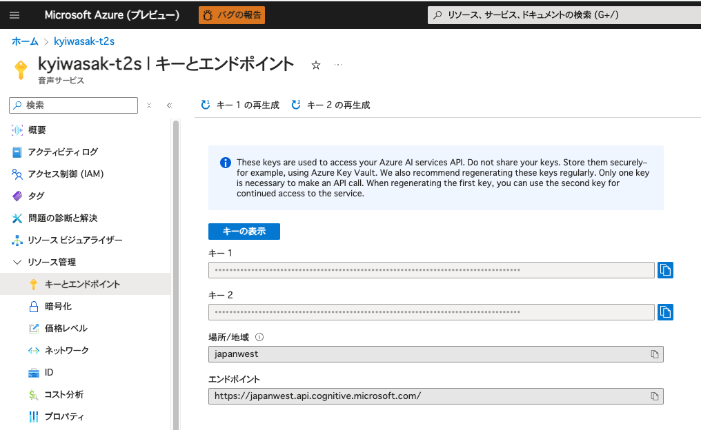

# アプリの主な機能

このアプリでは、Azureの[Speech-to-Speech](https://learn.microsoft.com/en-us/azure/ai-services/speech-service/text-to-speech)のAPIを使って、英文テキストを音声に変換して、リスニングに役立てます。

さらに、男性・女性の声も使い分けられるようなボタンも追加してみました。

## How to prepare

1. Azureで、text-to-speechのリソースを作成して、`キー１`、もしくは`キー２`と`場所/地域`をメモっておきます：

    

2. `python` libraryを揃えます。ターミナルで下記を入力して下さい。

```sh
pip install -r ./requirements.txt
```

## How to use the app!

1 . 環境変数を設定します。同じくターミナルで入力して下さい。

```sh
export AZURE_SPEECH_KEY="あなたのサブスクリプションキー"
export AZURE_SERVICE_REGION="あなたのサービスリージョン"
```


2. アプリの起動！（同じくターミナルで）

```sh
python ./app.py
```

3. ブラウザに`http://192.168.1.2:5001/`を貼り付けて、Enterキーを押しましょう！

    [](https://www.youtube.com/watch?v=FoVX-mC2KSA)
